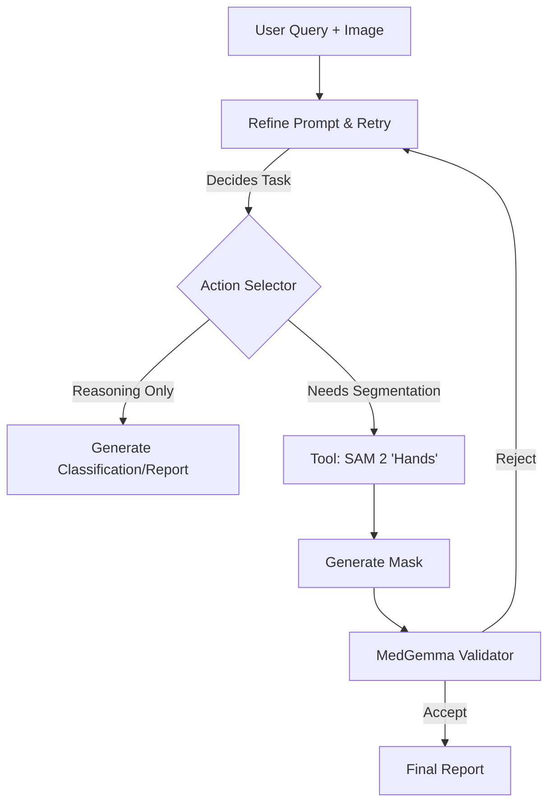

# System Architecture: MedGemma 1.5 + SAM 2 Agentic Layer

> [!IMPORTANT]
> **Hardware Strategy**: Hybrid Execution on RTX 5070 Laptop (8GB VRAM).
> **Core Concept**: **"Brain + Hands"**. MedGemma is the Brain (Reasoning/Detection), SAM 2 is the Hands (Segmentation).

## 1. High-Level Design (Agentic Orchestrator)

The system works as a **Stateful Agent** rather than a linear pipeline.

### Component Stack
1.  **Cognitive Core**: `MedGemma 1.5 (4B)`
    -   *Config*: 4-bit Quantization (NF4).
    -   *Role*: Understands complex clinical queries ("Find the acute stroke"), reasons about anatomy, and outputs **Bounding Box Prompts** for SAM 2.
2.  **Perception Core**: `SAM 2` (Segment Anything 2 - Medical Adapter)
    -   *Config*: Tiny/Small ViT backbone or "Medical SAM" LoRA.
    - **Description**: Meta's SAM 2 (Tiny).
    - **Role**: Takes the bounding box from Node 1 and generates a precise pixel-level mask.
    - **Input**: Image + Box Prompt.
    - **Output**: Binary Mask + IoU Score.
3.  **Knowledge Base**: `Vector Store (RAG)`
    -   *Content*: Index of `clinical_knowledge_book.md`.
    -   *Role*: Provides Guidelines (ACR/CAP) to MedGemma during reasoning.

## 2. Detailed Data Flow

### Stage 1: The Clinical Reasoner (MedGemma)
-   **Input**: `Image` + `Query` ("Evaluate for Glioblastoma").
-   **Internal Monologue**:
    1.  "Query asks for Glioblastoma."
    2.  "Searching for ring-enhancing lesions."
    3.  *Action*: "Found lesion at [x,y]. I need to measure the edema-to-tumor ratio."
    4.  *Tool Call*: `segment_lesion(box=[...], class="tumor")`, `segment_edema(box=[...])`.

### Stage 2: The Executor (SAM 2)
-   **Input**: `Image` + `Box/Text Prompt`.
-   **Constraint**: If VRAM is full, unload MedGemma -> Load SAM 2.
-   **Action**: Generates Binary Masks.

### Stage 3: The Synthesizer (Agent)
-   **Logic Layer**: Calculate Quantities.
    -   `Tumor Volume = Sum(Pixels) * Voxel_Size`
    -   `Edema Ratio = Edema_Vol / Tumor_Vol`
-   **Final Output**: MedGemma ingests the *measurements* + *original query* to write the standard radiology report.

## 3. Technology & Optimization Stack

### Software
-   **Orchestrator**: Python (Custom Class) or `LangGraph`.
-   **Inference**: `HuggingFace` + `bitsandbytes` (4-bit).
-   **Environment**: `conda env: medgamma`.

### Hardware Toggles
-   `--low-vram`: Triggers aggressive Model Swapping (Load A -> Run -> Unload -> Load B).
-   `--parallel`: Uses CPU for one model if possible (slow but keeps both loaded).
-   `--quantize`: Force 4-bit/8-bit on all models.

---

## 4. Data Layer (Training Strategy)

To achieve "Clinical Validity", we separate training streams:

### Stream A: Reasoning & Detection (The Brain)
*Objective: Teach MedGemma to identify pathologies and request tools.*
- **Dataset 1**: **VinDr-CXR** (Chest X-Ray)
    - *Features*: High-quality Bounding Boxes + Radiologist Consensus.
    - *Usage*: Train `[Detect] -> [Box]` logic.
- **Dataset 2**: **SLAKE / VQA-RAD**
    - *Features*: Q&A pairs with reasoning.
    - *Usage*: Train `[Query] -> [Reasoning Chain]`.

### Stream B: Segmentation Texture (The Hands)
*Objective: Teach SAM 2 "Medical Transparency" (X-ray overlay, MRI soft tissue).*
- **Dataset 1**: **BraTS (Brain Tumor Segmentation)**
    - *Features*: 4-channel MRI (T1/T2/FLAIR/T1ce) -> 3-class Masks.
    - *Usage*: Fine-tune SAM 2 Image Encoder (LoRA).
- **Dataset 2**: **VinDr-RibCXR / CheXmask**
    - *Features*: Precise Rib/Lung masks.
    - *Usage*: Adaptation for X-ray domain.
